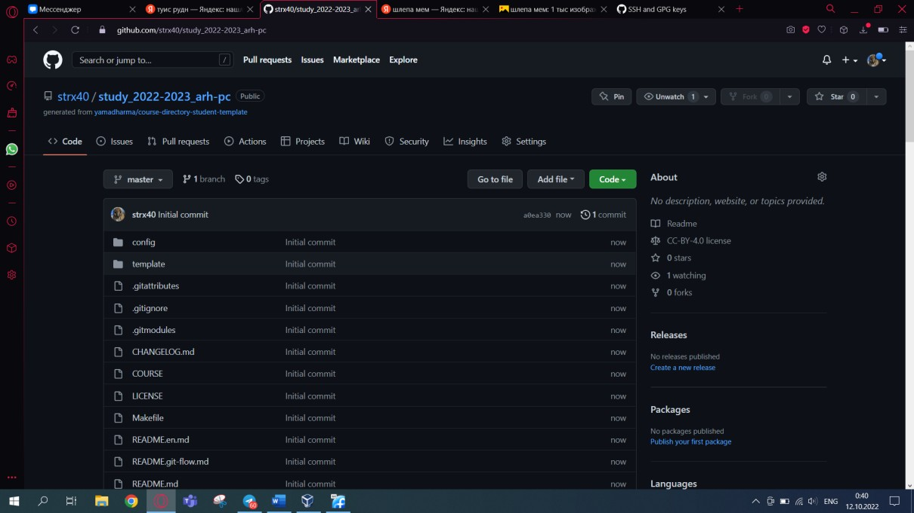
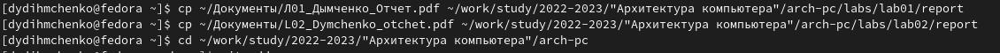

---
## Front matter
title: "Отчет по лабораторной работе №3"
subtitle: "Дисциплина: Архитектура компьютера"
author: "Дмитрий Юрьевич Дымченко"

## Generic otions
lang: ru-RU
toc-title: "Содержание"

## Bibliography
bibliography: bib/cite.bib
csl: pandoc/csl/gost-r-7-0-5-2008-numeric.csl

## Pdf output format
toc: true # Table of contents
toc-depth: 2
lof: true # List of figures
lot: true # List of tables
fontsize: 12pt
linestretch: 1.5
papersize: a4
documentclass: scrreprt
## I18n polyglossia
polyglossia-lang:
  name: russian
  options:
	- spelling=modern
	- babelshorthands=true
polyglossia-otherlangs:
  name: english
## I18n babel
babel-lang: russian
babel-otherlangs: english
## Fonts
mainfont: PT Serif
romanfont: PT Serif
sansfont: PT Sans
monofont: PT Mono
mainfontoptions: Ligatures=TeX
romanfontoptions: Ligatures=TeX
sansfontoptions: Ligatures=TeX,Scale=MatchLowercase
monofontoptions: Scale=MatchLowercase,Scale=0.9
## Biblatex
biblatex: true
biblio-style: "gost-numeric"
biblatexoptions:
  - parentracker=true
  - backend=biber
  - hyperref=auto
  - language=auto
  - autolang=other*
  - citestyle=gost-numeric
## Pandoc-crossref LaTeX customization
figureTitle: "Рис."
tableTitle: "Таблица"
listingTitle: "Листинг"
lofTitle: "Список иллюстраций"
lotTitle: "Список таблиц"
lolTitle: "Листинги"
## Misc options
indent: true
header-includes:
  - \usepackage{indentfirst}
  - \usepackage{float} # keep figures where there are in the text
  - \floatplacement{figure}{H} # keep figures where there are in the text
---

# Цель работы

Целью работы является изучить идеологию и применение средств контроля версий и приобрести практические навыки по работе с системой git.

# Выполнение лабораторной работы

Для начала работы необходимо создать учетную запись Github (рис. [-@fig:001]).

{ #fig:001 width=90% }

Далее нужно через терминал Fedora произвести первоначальную настройку Git (рис. [-@fig:002]).

{ #fig:002 width=90% }

Следующим шагом идет создание пары SSH ключей для последующей идентификации пользователя на сервере репозиториев. Также эти ключи необходимо скопировать специальной командой (рис. [-@fig:003]).

{ #fig:003 width=90% }

Далее скопированные ключи необходимо вставить в специальное поле в настройках профиля Github и задать ему имя (рис. [-@fig:004]).

{ #fig:004 width=90% }

Затем необходимо создать каталог для предмета «Архитектура компьютера» (рис. [-@fig:005]).

{ #fig:005 width=90% }

Следующим этапом работы идет создание репозитория на основе шаблона курса. Сначала нужно создать сам репозиторий на Github и задать ему имя (рис. [-@fig:006]).

{ #fig:006 width=90% }

Далее созданный репозиторий необходимо клонировать в каталог курса через специальную ссылку (рис. [-@fig:007]).

{ #fig:007 width=90% }

В ходе следующей стадии будет произведена настройка каталога курса. Для начала перейдем в каталог курса и удалим лишние файлы (рис. [-@fig:008]).

{ #fig:008 width=90% }

Затем специальной командой создадим необходимые для дальнейшей работы каталоги (рис. [-@fig:009]).

{ #fig:009 width=90% }

С помощью серии команд git отправим созданные каталоги на сервер Github. Далее убедимся в успешности отправки (рис. [-@fig:010])-[-@fig:011]), (рис. [-@fig:012]).

{ #fig:010 width=90% }

{ #fig:011 width=90% }

{ #fig:012 width=90% }

# Выполнение заданий для самостоятельной работы

В ходе выполнения заданий для самостоятельной работы необходимо скопировать файл отчета о выполнении о текущей работы, а также
предыдущих работ в соответствующие каталоги ОС и затем загрузить их на Github. Произведем указанные действия с отчетами о двух предыдущих работах. Отчет о выполнении третьей работы будет загружен после его завершения (рис. [-@fig:013]), (рис. [-@fig:014]).

{ #fig:013 width=90% }

{ #fig:014 width=90% }

# Выводы

В ходе выполнения данной лабораторной работы я изучил идеологию и применение средств контроля версий, а также приобрел практические навыки по работе с системой git.S

# Список литературы{.unnumbered}

::: {#refs}
:::
