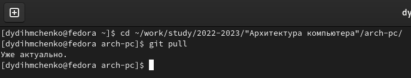
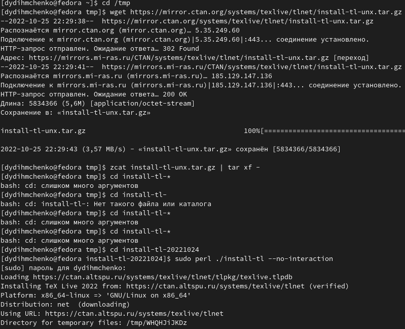
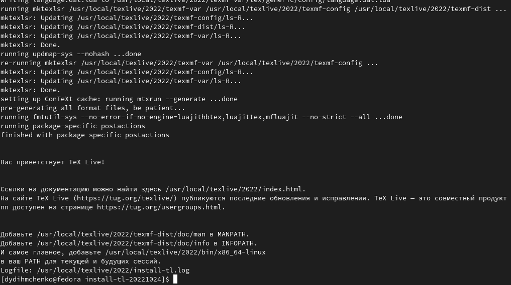
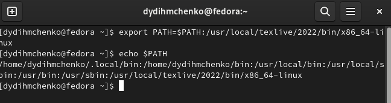
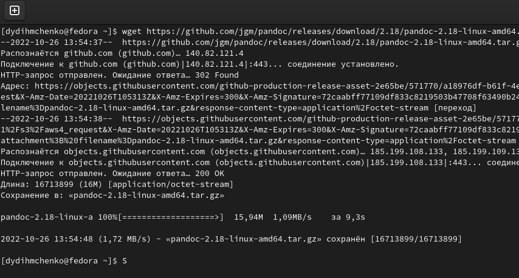
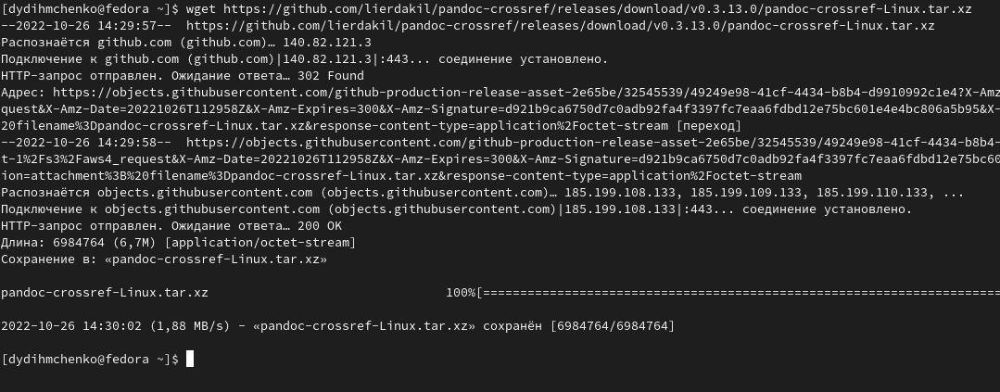
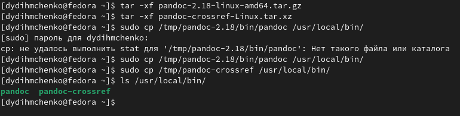
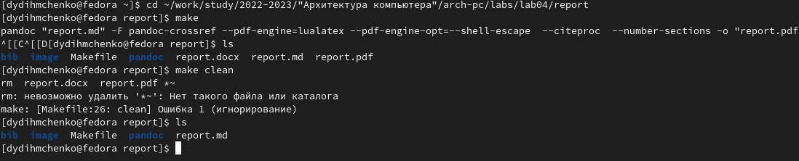
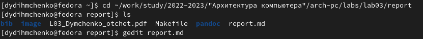
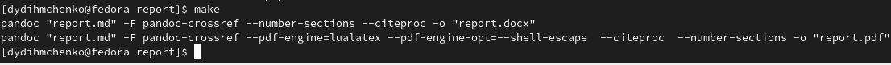

---
## Front matter
title: "Отчет по лабораторной работе №4"
subtitle: "Дисциплина: Архитектура компьютера"
author: "Дмитрий Юрьевич Дымченко"

## Generic otions
lang: ru-RU
toc-title: "Содержание"

## Bibliography
bibliography: bib/cite.bib
csl: pandoc/csl/gost-r-7-0-5-2008-numeric.csl

## Pdf output format
toc: true # Table of contents
toc-depth: 2
lof: true # List of figures
lot: true # List of tables
fontsize: 12pt
linestretch: 1.5
papersize: a4
documentclass: scrreprt
## I18n polyglossia
polyglossia-lang:
  name: russian
  options:
	- spelling=modern
	- babelshorthands=true
polyglossia-otherlangs:
  name: english
## I18n babel
babel-lang: russian
babel-otherlangs: english
## Fonts
mainfont: PT Serif
romanfont: PT Serif
sansfont: PT Sans
monofont: PT Mono
mainfontoptions: Ligatures=TeX
romanfontoptions: Ligatures=TeX
sansfontoptions: Ligatures=TeX,Scale=MatchLowercase
monofontoptions: Scale=MatchLowercase,Scale=0.9
## Biblatex
biblatex: true
biblio-style: "gost-numeric"
biblatexoptions:
  - parentracker=true
  - backend=biber
  - hyperref=auto
  - language=auto
  - autolang=other*
  - citestyle=gost-numeric
## Pandoc-crossref LaTeX customization
figureTitle: "Рис."
tableTitle: "Таблица"
listingTitle: "Листинг"
lofTitle: "Список иллюстраций"
lotTitle: "Список таблиц"
lolTitle: "Листинги"
## Misc options
indent: true
header-includes:
  - \usepackage{indentfirst}
  - \usepackage{float} # keep figures where there are in the text
  - \floatplacement{figure}{H} # keep figures where there are in the text
---

# Цель работы

Целью работы является освоение процедуры оформления отчетов с помощью легковесного языка разметки Markdown.

# Выполнение лабораторной работы

Для начала работы необходимо через терминал перейти в каталог курса и обновить локальный репозиторий командой git pull (рис. [-@fig:001]).

{ #fig:001 width=90% }

Для дальнейшей работы необходимо установить TeX Live, Pandoc и Pandoc-crossref. Сначала займемся установкой TeX Live (рис. [-@fig:002]), (рис. [-@fig:003]), (рис. [-@fig:004]).

{ #fig:002 width=90% }

{ #fig:003 width=90% }

{ #fig:004 width=90% }

Далее необходимо установить Pandoc и Pandoc Crossref (рис. [-@fig:005]), (рис. [-@fig:006]).

{ #fig:005 width=90% }

{ #fig:006 width=90% }

Затем распаковываем архивы и копируем файлы в нужный каталог. Командой ls проверяем успешность выполнения задачи (рис. [-@fig:007]).

{ #fig:007 width=90% }

После установки необходимого ПО вернемся к выполнению работы. Проведем компиляцию шаблона с использованием Makefile. Далее проверим, создались ли файлы и удалим их командой make clean (рис. [-@fig:008]).

{ #fig:008 width=90% }

# Выполнение заданий для самостоятельной работы

Заданием для самостоятельной работы было выполнение отчета к лабораторной работе №3 с использованием Markdown. Для этого необходимо оформить отчет, а затем командой make в каталоге отчета создать файлы .docx и .pdf (рис. [-@fig:009]), (рис. [-@fig:010]). 

{ #fig:009 width=90% }

{ #fig:010 width=90% }

# Выводы

В ходе выполнения данной работы я освоил процедуру оформления отчетов с помощью легковесного языка разметки Markdown.

